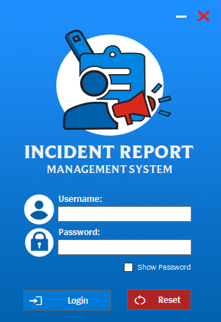
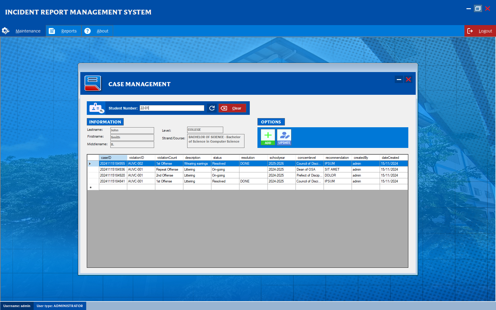
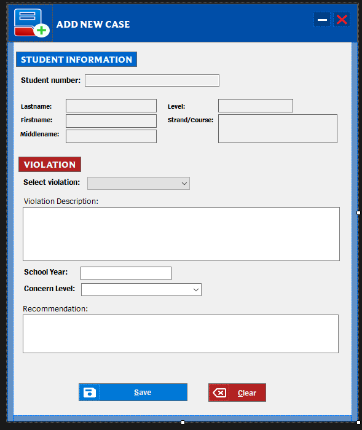
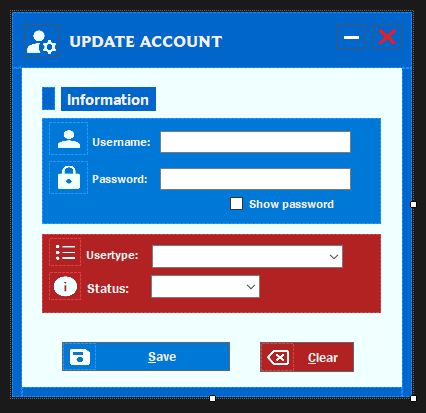

# Incident Report Management System

A secure, full-stack desktop application for logging, tracking, and resolving student incident/violation cases, built with C# (.NET), Windows Forms, and Microsoft SQL Server.
<div align="center"> 



</div>
## Overview

Incident Report Management System streamlines the full incident lifecycle — from student violation intake to case resolution — for institutions that need structured, auditable disciplinary record-keeping. It replaces manual/paper-based tracking with a centralized, role-based desktop tool.

## Features

- **Role-based access control (RBAC)** — separate account types and permissions (e.g. Administrator vs. staff), with account creation and status management handled through a dedicated maintenance panel.
- **Case management dashboard** — look up a student by number and view their full case history, including violation type, offense count, status, resolution, school year, concern level, and recommendation, in a single sortable grid.
- **Add new case workflow** — a guided form for logging a new incident: student information, violation selection, description, school year, concern level, and recommendation.
- **Account maintenance** — update usernames, passwords, user types, and account status directly from an administrator-only screen.
- **Audit-friendly data model** — every case is stamped with `createdBy` and `dateCreated`, supporting traceability across the full incident history.

## Screenshots

| Login | Case Management |
|---|---|
|  |  |

| Add New Case | Update Account |
|---|---|
|  |  |

## Tech Stack

- **Language / Framework:** C#, .NET (Windows Forms), targeting `net472`
- **Database:** Microsoft SQL Server (MSSQL)
- **Architecture:** Form-based UI with a dedicated `db` layer for connection and query handling

## Getting Started

### Prerequisites

- Visual Studio 2022 (or later) with the **.NET desktop development** workload
- SQL Server (Express edition is sufficient) or access to a SQL Server instance
- .NET Framework 4.7.2 targeting pack

### Setup

1. **Clone the repository**
   ```bash
   git clone https://github.com/EdjayDev/IncidentReportManagement.git
   ```

2. **Configure the database connection**
   Copy the example config and fill in your own SQL Server details:
   ```bash
   copy dbconfig.example.json dbconfig.json
   ```
   Then edit `dbconfig.json` with your server address, database name, and credentials. For a named SQL Server Express instance, the server address typically looks like `YOUR-PC-NAME\SQLEXPRESS`.

3. **Set up the database**
   Run the provided SQL schema/scripts against your SQL Server instance to create the required tables (students, accounts, cases, violations).

4. **Build and run**
   Open `IncidentReportSystem.csproj` in Visual Studio, restore any NuGet packages, and build. `dbconfig.json` will be copied to the output directory automatically as part of the build.

## Project Structure

```
IncidentReportManagement/
├── db/                     # Database connection and config handling
├── main/                   # Application forms (Login, Case Management, Add/Update screens, etc.)
├── Properties/
├── dbconfig.example.json   # Template — copy to dbconfig.json and fill in your own values
├── app.config
└── IncidentReportSystem.csproj
```

## License

This project is available for educational and portfolio reference purposes.
